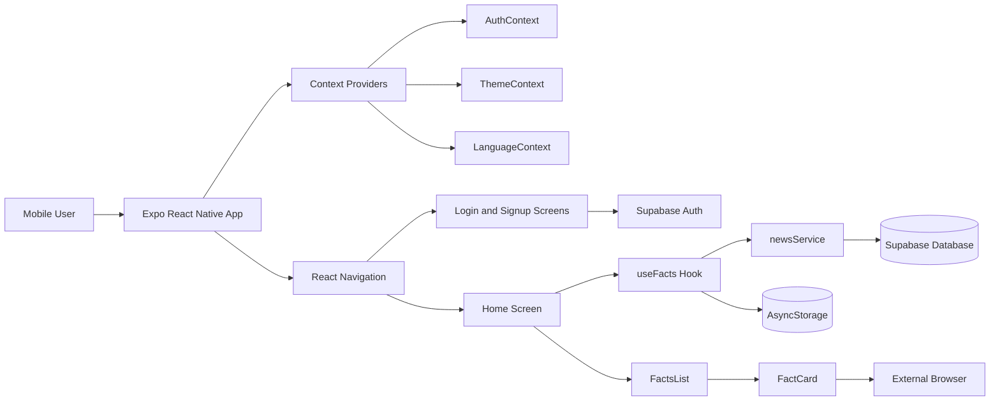
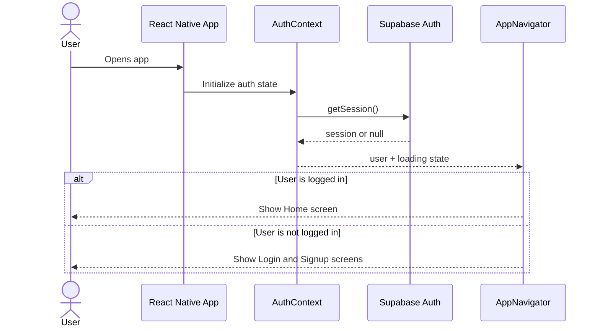
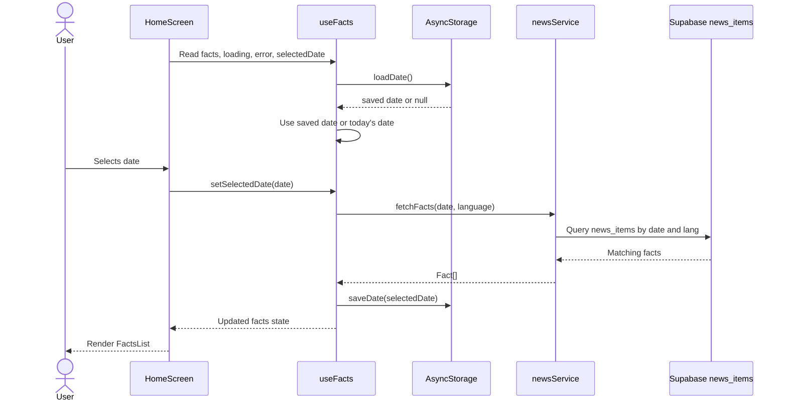
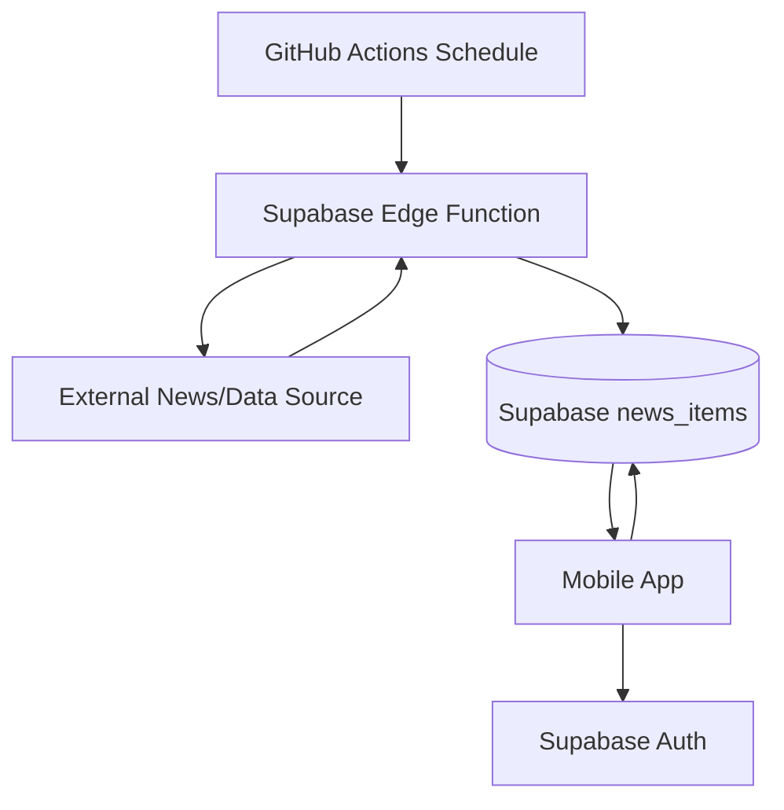

# DailyDigest10 Mobile

DailyDigest10 is an Expo React Native mobile app that shows short daily news facts for a selected date. The app uses Supabase for authentication and data storage, React Navigation for screen routing, AsyncStorage for local persistence, and Jest for automated testing.

This README explains the project architecture, setup steps, environment variables, Supabase schema, app flow, test commands, and improvement ideas.

## Table Of Contents

- [Project Overview](#project-overview)
- [Tech Stack](#tech-stack)
- [System Architecture](#system-architecture)
- [Application Flow](#application-flow)
- [Folder Structure](#folder-structure)
- [Core Modules](#core-modules)
- [Environment Variables](#environment-variables)
- [Supabase Schema](#supabase-schema)
- [GitHub Automation](#github-automation)
- [Local Setup](#local-setup)
- [Run The App](#run-the-app)
- [Testing](#testing)
- [Build And Deployment Notes](#build-and-deployment-notes)
- [Security Notes](#security-notes)
- [Improvement Roadmap](#improvement-roadmap)

## Project Overview

The app has three main user-facing areas:

1. Authentication flow
   - Users can sign up with email and password.
   - Users can log in with Supabase authentication.
   - Logged-in users can log out from the app header.

2. Daily facts flow
   - After login, users land on the home screen.
   - The home screen displays the selected date.
   - Users can pick a different date.
   - The app fetches facts/news items for that date from Supabase.

3. Preferences flow
   - Theme state is stored locally.
   - Date selection is stored locally.
   - Language state is handled through React Context.

## Tech Stack

| Area | Technology |
| --- | --- |
| Mobile framework | Expo + React Native |
| Language | TypeScript |
| Navigation | React Navigation native stack |
| Backend/Auth | Supabase |
| Local storage | AsyncStorage |
| Date picker | `@react-native-community/datetimepicker` |
| Icons | Expo Vector Icons |
| Testing | Jest + Testing Library |
| Package managers | npm and pnpm lockfiles are present |

## System Architecture



### Architecture Layers

| Layer | Responsibility | Important Files |
| --- | --- | --- |
| Entry layer | Starts the Expo app | `index.ts`, `App.tsx` |
| Provider layer | Makes global app state available | `src/context/*.tsx` |
| Navigation layer | Decides which screens are visible | `src/components/navigation/AppNavigator.tsx` |
| Screen layer | Main app pages | `src/screens/*.tsx` |
| Hook layer | Reusable state and side-effect logic | `src/hooks/useFacts.ts` |
| Service layer | API/database communication | `src/services/*.ts` |
| Component layer | Reusable UI blocks | `src/components/*.tsx` |
| Storage layer | Local persistence | `src/utils/storage.ts` |
| Test layer | Unit/component/hook tests | `src/**/__tests__/*.tsx` |

## Application Flow

### Authentication Flow



### Daily Facts Fetch Flow



## Folder Structure

```text
dd10-mobile/
├── .github/
│   └── workflows/
│       └── daily-facts.yml
├── assets/
│   ├── adaptive-icon.png
│   ├── favicon.png
│   ├── icon.png
│   └── splash-icon.png
├── src/
│   ├── components/
│   │   ├── navigation/
│   │   │   └── AppNavigator.tsx
│   │   ├── __tests__/
│   │   ├── DatePickerButton.tsx
│   │   ├── FactCard.tsx
│   │   ├── FactsList.tsx
│   │   ├── LanguageToggle.tsx
│   │   ├── LogoutButton.tsx
│   │   └── ThemeToggle.tsx
│   ├── context/
│   │   ├── AuthContext.tsx
│   │   ├── LanguageContext.tsx
│   │   └── ThemeContext.tsx
│   ├── hooks/
│   │   ├── __tests__/
│   │   └── useFacts.ts
│   ├── screens/
│   │   ├── HomeScreen.tsx
│   │   ├── LoginScreen.tsx
│   │   └── SignupScreen.tsx
│   ├── services/
│   │   ├── __mocks__/
│   │   ├── newsService.ts
│   │   └── supabase.ts
│   ├── theme/
│   │   └── color.ts
│   └── utils/
│       └── storage.ts
├── App.tsx
├── app.json
├── index.ts
├── jest.config.js
├── package.json
└── tsconfig.json
```

## Core Modules

### `index.ts`

This is the Expo entry point. It imports the root `App` component and registers it using `registerRootComponent`.

### `App.tsx`

`App.tsx` wraps the app with global providers:

- `LanguageProvider` for language state.
- `ThemeProvider` for light/dark theme state.
- `AuthProvider` for Supabase authentication state.
- `AppNavigator` for screen routing.

### `src/components/navigation/AppNavigator.tsx`

This file controls the navigation tree.

- If authentication is loading, it shows a loading screen.
- If a user exists, it shows the `Home` screen.
- If no user exists, it shows `Login` and `Signup`.
- The logged-in header includes a logout button.

### `src/context/AuthContext.tsx`

This context centralizes authentication logic.

Main responsibilities:

- Load existing Supabase session on app start.
- Subscribe to auth state changes.
- Expose `signIn`, `signUp`, and `signOut`.
- Share `user` and `loading` state across the app.

### `src/context/ThemeContext.tsx`

This context handles theme state.

Main responsibilities:

- Load saved theme from AsyncStorage.
- Fall back to system appearance if no saved theme exists.
- Toggle between light and dark mode.
- Save selected theme locally.

### `src/context/LanguageContext.tsx`

This context handles language state.

Current supported values:

- `en`
- `hi`

It also stores `selectedDateISO`, although the main date selection logic is currently handled inside `useFacts`.

### `src/hooks/useFacts.ts`

This custom hook is the main data-fetching layer for daily facts.

It manages:

- `facts`
- `loading`
- `error`
- `selectedDate`
- `setSelectedDate`

Flow:

1. Load the last selected date from AsyncStorage.
2. If no saved date exists, use the current date.
3. Convert the date to `YYYY-MM-DD`.
4. Fetch facts from Supabase using `fetchFacts`.
5. Save the selected date locally.
6. Return state to the UI.

### `src/services/newsService.ts`

This service fetches news/facts from Supabase.

Current query:

- Table: `news_items`
- Selected columns: `id`, `date`, `content`, `link`
- Filters:
  - `date` equals selected date
  - `lang` equals selected language
- Sort:
  - `created_at` ascending

### `src/services/supabase.ts`

This file creates a Supabase client using environment variables:

- `EXPO_PUBLIC_SUPABASE_URL`
- `EXPO_PUBLIC_SUPABASE_ANON_KEY`

### `src/screens/HomeScreen.tsx`

The home screen renders the main logged-in experience.

It shows:

- Selected date
- Date picker button
- Facts list
- Loading/error/empty states through `FactsList`

### `src/screens/LoginScreen.tsx`

The login screen allows users to sign in with email and password.

Features:

- Email input
- Password input
- Show/hide password icon
- Basic empty field validation
- Supabase login call through `useAuth`
- Link to signup screen

### `src/screens/SignupScreen.tsx`

The signup screen allows new users to create an account.

Features:

- Email input
- Password input
- Basic empty field validation
- Minimum password length validation
- Supabase signup call through `useAuth`
- Redirect to login screen after account creation

### `src/components/FactsList.tsx`

This component renders four possible states:

1. Loading state
2. Error state
3. Empty state
4. List of facts

### `src/components/FactCard.tsx`

This component renders one fact/news item.

It displays:

- Fact summary/content
- Optional "Read more" text if a link exists

If the card has a link, pressing the card opens the URL using React Native `Linking`.

### `src/components/DatePickerButton.tsx`

This component shows a calendar icon and opens a native date picker.

Important behavior:

- Android closes picker after date selection.
- iOS can keep picker visible depending on platform behavior.
- Future dates are blocked using `maximumDate={new Date()}`.

### `src/utils/storage.ts`

This file stores and loads the last selected date using AsyncStorage.

Storage key:

```text
lastSelectedDate
```

## Environment Variables

Create a `.env` file in the project root:

```env
EXPO_PUBLIC_SUPABASE_URL=https://your-project-ref.supabase.co
EXPO_PUBLIC_SUPABASE_ANON_KEY=your-supabase-anon-key
```

These variables are used by the Supabase client.

Important:

- `EXPO_PUBLIC_` variables are exposed to the client bundle.
- Never store service role keys in the mobile app.
- Do not commit real `.env` files to GitHub.
- Use `.env.example` for documentation and local onboarding.

Recommended `.env.example`:

```env
EXPO_PUBLIC_SUPABASE_URL=
EXPO_PUBLIC_SUPABASE_ANON_KEY=
```

## Supabase Schema

The app expects a `news_items` table.

Recommended SQL schema:

```sql
create table if not exists public.news_items (
  id uuid primary key default gen_random_uuid(),
  date date not null,
  lang text not null check (lang in ('en', 'hi')),
  content text not null,
  link text,
  created_at timestamptz not null default now()
);
```

Recommended indexes:

```sql
create index if not exists news_items_date_lang_idx
on public.news_items (date, lang);

create index if not exists news_items_created_at_idx
on public.news_items (created_at);
```

Recommended Row Level Security:

```sql
alter table public.news_items enable row level security;
```

Read policy for authenticated users:

```sql
create policy "Authenticated users can read news items"
on public.news_items
for select
to authenticated
using (true);
```

Optional read policy for public users:

```sql
create policy "Public users can read news items"
on public.news_items
for select
to anon
using (true);
```

Use the public policy only if the app should show news before login or if news content is not private.

## Backend Data Flow



## GitHub Automation

The repository includes:

```text
.github/workflows/daily-facts.yml
```

Purpose:

- Runs on a daily cron schedule.
- Can also be triggered manually with `workflow_dispatch`.
- Calls a Supabase Edge Function endpoint.

Recommended improvement:

- Move Supabase keys from the workflow file to GitHub Actions secrets.

Example:

```yaml
env:
  SUPABASE_ANON_KEY: ${{ secrets.SUPABASE_ANON_KEY }}
```

## Local Setup

### 1. Clone the repository

```bash
git clone https://github.com/sumitbhskr/dd10-mobile.git
cd dd10-mobile
```

### 2. Install dependencies

Using npm:

```bash
npm install
```

Using pnpm:

```bash
pnpm install
```

Choose one package manager for the project team and keep only one lockfile if possible.

### 3. Add environment variables

Create `.env` in the root folder:

```env
EXPO_PUBLIC_SUPABASE_URL=https://your-project-ref.supabase.co
EXPO_PUBLIC_SUPABASE_ANON_KEY=your-supabase-anon-key
```

### 4. Start the development server

```bash
npm start
```

or:

```bash
npx expo start
```

## Run The App

Run on Android:

```bash
npm run android
```

Run on iOS:

```bash
npm run ios
```

Run on web:

```bash
npm run web
```

Start Expo:

```bash
npm start
```

## Testing

Run all tests:

```bash
npm test
```

Run tests in watch mode:

```bash
npm run test:watch
```

Run TypeScript type checking:

```bash
npx tsc --noEmit
```

Current test areas:

- `FactCard` component rendering
- `FactsList` loading/error/empty/list states
- `useFacts` hook behavior

Recommended test improvements:

- Add tests for login and signup validation.
- Add tests for `DatePickerButton`.
- Mock `Linking.openURL` in `FactCard` tests.
- Add tests for auth state routing in `AppNavigator`.
- Add tests for theme and language toggles.

## Build And Deployment Notes

For production mobile builds, use EAS Build:

```bash
npx eas build --platform android
```

```bash
npx eas build --platform ios
```

Before production release:

- Configure app icons and splash screen.
- Confirm Supabase environment variables.
- Review Row Level Security policies.
- Remove hard-coded secrets from workflows.
- Test on real Android and iOS devices.

## Security Notes

Recommended security checklist:

- Do not commit `.env` files.
- Do not put service role keys in the mobile app.
- Store GitHub workflow secrets in GitHub Actions secrets.
- Enable Supabase Row Level Security.
- Use strict table policies.
- Validate all URLs before opening external links.
- Keep dependencies updated.
- Add error monitoring for production builds.

## Improvement Roadmap

### High Priority

- Use a single shared Supabase client instead of creating clients in multiple files.
- Remove commented-out legacy code from components and services.
- Move workflow secrets to GitHub Actions secrets.
- Add `.env.example`.
- Fix encoding issues in Hindi text.
- Add proper navigation types instead of `useNavigation<any>`.
- Replace `user: any` with Supabase `User | null`.

### Medium Priority

- Add theme support to login and signup screens.
- Add loading states to login/signup buttons.
- Add form validation for email format.
- Add localized messages for English and Hindi.
- Add pull-to-refresh on the facts list.
- Add retry button on network error.
- Add pagination or limit for large news lists.

### Low Priority

- Add app logo branding to auth screens.
- Add skeleton loaders.
- Add share button for each fact.
- Add bookmark/save feature.
- Add offline cache for recently loaded facts.
- Add analytics for date selection and article clicks.

## Interview Explanation Summary

You can explain the project like this:

> DailyDigest10 is a React Native mobile app built with Expo and TypeScript. It uses Supabase for authentication and for storing daily news facts. The app starts from `index.ts`, loads `App.tsx`, wraps the UI with context providers for language, theme, and authentication, and then uses `AppNavigator` to decide whether the user should see login/signup screens or the home screen. After login, `HomeScreen` uses the `useFacts` custom hook to load the last selected date from AsyncStorage, fetch matching facts from the Supabase `news_items` table, and render them using `FactsList` and `FactCard`. The project also includes Jest tests and a GitHub Actions workflow that can trigger a Supabase Edge Function daily.

## Useful Commands

```bash
npm install
npm start
npm run android
npm run ios
npm run web
npm test
npm run test:watch
npx tsc --noEmit
```

